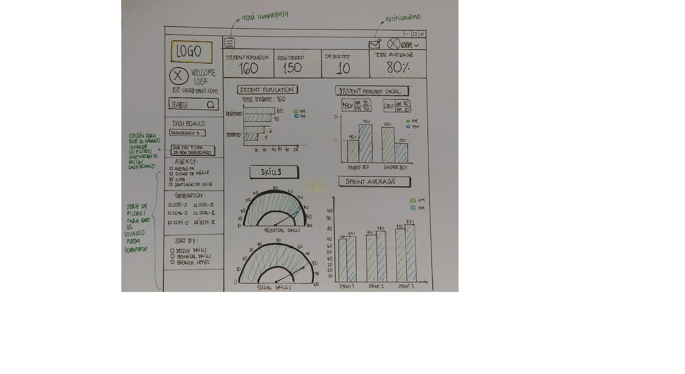

# Dashboard Challenge

* **Track:** _Common Core_
* **Curso:** _Creando un sitio web interactivo con JavaScript_
* **Unidad:** _Intro a User Experience Design_

***
## Objetivo

El dashboard es una herramienta utilizada por profesores, training managers, directores y gerentes de Laboratoria para ver rápidamente qué está pasando en el salón de clases de Laboratoria. En el dashboard, los usuarios mencionados pueden ver rápidamente estadísticas y datos en tiempo real como:

- Número de alumnas inscritas
- Número de alumnas que desertaron
- Número y porcentaje de alumnas que pasan el criterio mínimo de evaluación
- Promedio de notas por sprint
- Promedio de notas HSE
- Promedio de notas técnicas

Además, dado que Laboratoria tiene muchas generaciones, regularmente 2 generaciones por año (estas generaciones empezaron en el 2014), y que opera en 4 sedes (Arequipa, Ciudad de México, Lima y Santiago de Chile), es posible que los usuarios quieran ver datos de sedes / generaciones anteriores para poder hacer comparaciones.

## Nuestra propuesta

- Se presenta un sketch como solución a lo pedido por el usuario, el cual desea visualizar de forma directa, mediante un dashboard, la informacion actual de las alumnas , asi como su rendimiento academico y , tambien, poder hacer comparaciones a partir de sedes, generaciones y skills.

- Nuestra solución ofrece de manera directa y dinamica los filtros pertinentes para que el usuario pueda escoger los topicos a comparar dados en el menu lateral  y que pueda guardar dichos filtros en un nuevo dashboard dados en el botón que figura en la imagen, asi pueda acceder directamente a esta informacion pudiendo satisfacer su necesidad central.

